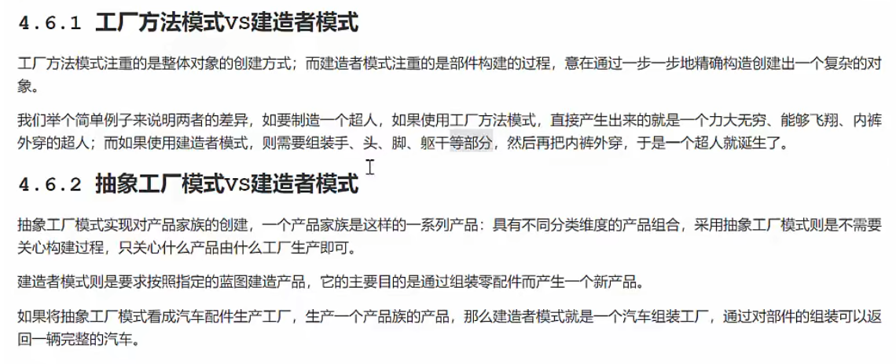

# 设计模式分类
## 创建型模式
   用于描述如何创建对象，主要关注点是“怎样创建对象”，它的主要特点是“将对象的创建与使用分离”。
   
    单例模式，工厂方法模式，抽象工厂模式，建造者模式，原型模式。

## 结构型模式
   用于描述如何实现类或对象的组合，主要关注点是怎样实现类或对象的组合，它的主要特点是“将类的功能层次结构和类的实现层次结构分离”。用于描述如何将类和对象按某种布局组成更大的结构 
        
    代理模式，适配器模式，桥接模式，装饰模式，外观模式，享元模式，组合模式。

## 行为型模式
用于描述类或对象之间怎样相互协作共同完成单个对象都无法单独完成的任务，以及怎样分配职责。它的主要特点是“关注对象之间的通信”。
   
    模板方法模式，命令模式，迭代器模式，观察者模式，中介者模式，备忘录模式，解释器模式，状态模式，策略模式，访问者模式，责任链模式。

# 设计模式常用的设计原则
## 1.单一职责原则
    一个类只负责一项职责，或者可以定义为：就一个类而言，应该仅有一个引起它变化的原因。
## 2.开放封闭原则
    一个软件实体如类、模块和函数应该对扩展开放，对修改关闭。用抽象构建框架，用实现扩展细节。
## 3.里氏替换原则
    所有引用基类的地方必须能透明地使用其子类的对象。
## 4.依赖倒转原则
    高层模块不应该依赖底层模块，二者都应该依赖其抽象；抽象不应该依赖细节，细节应该依赖抽象。
    依赖倒转的核心思想是面向接口编程。
    依赖关系传递的三种方式
        接口传递，构造方法传递，setter方法传递
## 5.接口隔离原则
    使用多个专门的接口，而不使用单一的总接口，客户端不应该依赖它不需要的接口。
    通过接口隔离，我们可以建立最小的依赖关系，从而实现系统解耦和高内聚。
    用到了上转型，下转型，多态，抽象类，接口等。
## 6.迪米特法则
    一个软件实体应当尽可能少地与其他实体发生相互作用。
    一个类对自己依赖的类知道的越少越好，也就是说，对于被依赖的类不管多么复杂，都尽量将逻辑封装在类的内部。
    对于外部而言，只需要知道它提供的public方法，而不需要去了解它内部的复杂逻辑。
    出现在成员变量、方法的输入输出参数中的类，都是直接朋友，而出现在局部变量中的类则不是直接朋友。
## 7.合成复用原则
    尽量使用合成/聚合的方式，而不是使用继承。

## 创建型模式对比
| 模式 | 优点 | 缺点 | 适用场景 |
| :---: | :---: | :---: | :---: |
| 单例模式 | 1.在内存中只有一个实例，减少了内存开销；2.可以避免对资源的多重占用；3.设置全局访问点，严格控制访问。 | 1.没有接口，扩展困难；2.与单一职责原则冲突。 | 1.要求生产唯一序列号；2.创建的一个对象需要消耗的资源过多，如要访问IO和数据库等资源；3.需要定义大量静态常量和静态方法（如工具类）。 |
| 工厂方法模式 | 1.用户只需要关心所需产品对应的工厂，无需关心创建细节；2.加入新产品符合开闭原则，提高系统的可扩展性。 | 1.类的个数容易过多，增加复杂度；2.增加了系统的抽象性和理解难度。 | 1.创建对象需要大量重复的代码；2.客户端（应用层）不依赖于产品类实例如何被创建、实现等细节；3.一个类通过其子类来指定创建哪个对象。 |
| 抽象工厂模式 | 1.当一个产品族中的多个对象被设计成一起工作时，它能够保证客户端始终只使用同一个产品族中的对象；2.增加新的产品族很方便，无须修改已有系统，符合开闭原则。 | 1.增加新的产品等级结构麻烦，需要修改抽象工厂的接口，会引起较大的变动。 | 1.系统中有多于一个的产品族，而系统只消费其中某一产品族；2.同属于同一个产品族的产品将在一起使用。 |
| 建造者模式 | 1.封装性好，创建和使用分离；2.扩展性好，建造类之间独立，一定程度上解耦；3.客户端不必知道产品内部组成的细节；4.便于控制细节风险。 | 1.产生多余的Builder对象；2.产品内部发生变化，建造者都要修改，成本较大。 | 1.相同的方法，不同的执行顺序，产生不同的事件结果时；2.多个部件或零件，都可以装配到一个对象中，但是产生的运行结果又不相同时；3.产品类非常复杂，或者产品类中的调用顺序不同产生了不同的作用。 |
| 原型模式 | 1.性能优良；2.逃避构造函数的约束。 | 1.需要为每一个类配备一个克隆方法，而且该克隆方法位于一个类的内部，当对已有的类进行改造时，需要修改代码，违背了开闭原则；2.当实现深克隆时需要编写较为复杂的代码，而且当对象之间存在多重嵌套引用时，为了实现深克隆，每一层对象对应的类都必须支持深克隆，实现起来会比较麻烦。 | 1.类初始化需要消化非常多的资源，这个资源包括数据、硬件资源等；2.new产生一个对象需要非常繁琐的数据准备或访问权限；3.构造函数比较复杂。 |
| 简单工厂模式 | 1.工厂类包含必要的判断逻辑，可以决定在什么时候创建哪一个产品类的实例；2.客户端可以免除直接创建产品对象的责任，而仅仅“消费”产品；3.简单工厂模式通过这种做法实现了对责任的分割。 | 1.工厂类的职责相对过重，增加新的产品时需要修改工厂逻辑，违背开闭原则；2.使用简单工厂模式势必会增加系统中类的个数（引入新的工厂类），增加了系统的复杂度和理解难度。 | 1.工厂类负责创建的对象较少；2.客户端（应用层）只知道传入工厂类的参数，对于如何创建对象（逻辑）不关心。 |

