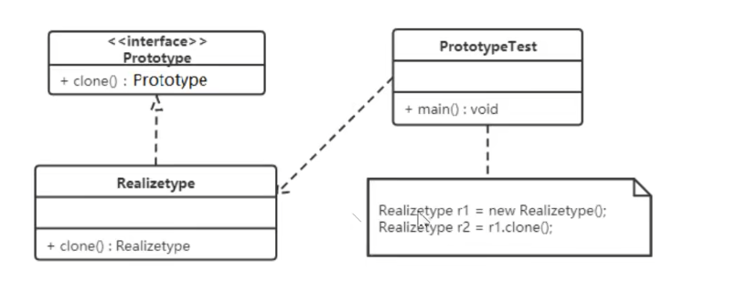

# 原型模式
## 概述
原型模式是一种创建型设计模式，它允许一个对象再创建另外一个可定制的对象，而且不需要知道任何创建的细节，通过复制一个已经存在的实例来返回新的实例，而不是新建实例。

## 结构
原型模式包含以下主要角色。
* 抽象原型类：规定了具体原型对象必须实现的接口。
* 具体原型类：实现抽象原型类的 clone() 方法，它是可被复制的对象。
* 访问类：使用具体原型类中的 clone() 方法来复制新的对象。

## 实现
浅克隆
    
    创建一个新对象，新对象的属性和原对象属性一样，对于非基本类型的属性，仍然指向原对象的内存地址。
使用场景
* 类初始化消耗资源较多
* new 产生一个对象需要非常繁琐的数据准备或访问权限
* 性能和安全要求的场景

深克隆

    创建一个新对象，新对象的属性和原对象属性一样，对于非基本类型的属性，也将创建一个新的对象，而不是指向原对象的内存地址。
